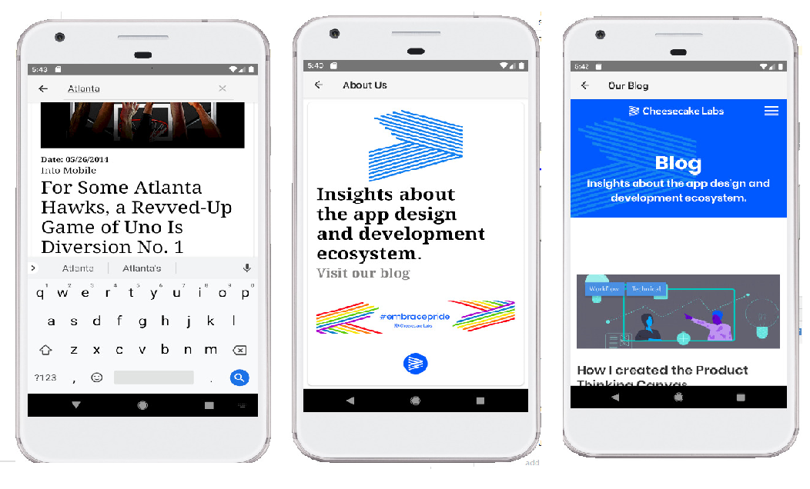

# Trainee Developers Mobile Android (Cupcaker Program)

### Cheesecakelabs

## App Daily Cake

The purpose of the app is a bit simple, fetch a JSON file in a server, turn this in an obejct and display it in a screen.
This object has some attributes, as img_url, for example, wich aims to be displayed in that screen as well.
Also, some features pretend to help in the usability as a back navigate bar and a **singleTop** configuration wich means that whenever the user click in a image and go to a different view, when he come back "he will be"  at the same item of the *view* clicked.

## Let´s run it

### this app was build on this IDE especifications

~~~~
* Android Studio 3.4.1
* Build #AI-183.6156.11.34.5522156, built on May 1, 2019
* JRE: 1.8.0_152-release-1343-b01 amd64
* JVM: OpenJDK 64-Bit Server VM by JetBrains s.r.o
* Windows 10 10.0
* Programming Language : Kotlin
~~~~

### Dowloading project from github

Unzip the project in preferecial folder
In Android Studio go to  'Open an existing Android Studio Project'
Look for the dowloaded project in that folder and choose it
Now you open these folders   'App > Java > com.example.workflowupdate > View > activity > MainActivity
In MainActivity
go to
Build > Clean Project
make sure the project will be succesfully 'buillded', otherwise keep "cleaning the project"
'Run > RunApp'
if you already have a virtual device avaliable, choose it
in the other hand if you don´t
go to 'Create Neew Virtual Device > Phone
choose any you want > Next
and now download a **system image** [preferably a recent android version, 28+], after
Next > Finish > OK

### Welcome to Daily Cake ###

Navigate by yourself, feel yourself at home.

## Development report

The project don't follow a especific developement pattern, however models, interfaces, activities, views and adapters are all organized in different packages. Inside view package there are more two packages, which are the three activities created and the MainAdapter in a different package.
Three activities stands for three screens, or three levels.
The first one, is the list with all posts fecthed from the endpoint. Everything´s working fine. I choose a recyclerview for good reasons, one of them was the LinearLayout possibility among many others.
The second layout, stands for a screen that opens whenever you you click on a news. Is always the same screen, which invite the user to the third one screen. The last layout was setted as WebView because it allows the user access through the app the Cheesecake´s blog, and for real, it has a great usability.
Another nice thing that the app has is the 'back' icon which allows a more fluid use of the application.

## Code

So, **picasso Lib** did almost everything. The most important one, after load the images of course, is that throught Picasso, The **Daily Cake** caches images, wich means not waste mobile data from their users!
The project have some fails, the first one is in sort the items.
A method in MainActivy try to do it through string comparisons but fails, probably for logic problems. I also wasn´t able mark the articles as read.
A important note about a specific decision of project, was decide to use Okhttp3 request and not Retrofit. I started with retrofit and Gson library working toguether but I spent too much time trying to solve problems with a insistent Kotlin reflection issue. I apologize for don´t follow the suggested lib.

  

The used language was [Kotlin](https://kotlinlang.org/) and gret open libs such as
* [JetBrains/kotlin](https://github.com/JetBrains/kotlin),
* [Picasso](https://square.github.io/picasso/) 
* [Retrofit](https://square.github.io/retrofit/)
* [Gson](https://github.com/google/gson)
  and [CircleImageView](https://github.com/hdodenhof/CircleImageView) were the core of this whole project.

## Motivation

Become a brad new cupcaker. Also, build that app was a huge opportunity to improve my programming skils, specifically in mobile development.

## final considerations

I just like to say thank you guys for this worthy opportunity. It was a huge experience and for sure I learned a lot. Is important let you know, that this was my first contact with mobile development and with kotlin programming language as well.
I guarantee you, that none inconsistent in my code represents laziness or that sort of thing. I work with the best in me, and tried hard do the best I can with I alredy had in every piece of code.
So, that's it. Thank you all again and I hope see you soon.

## License

	

